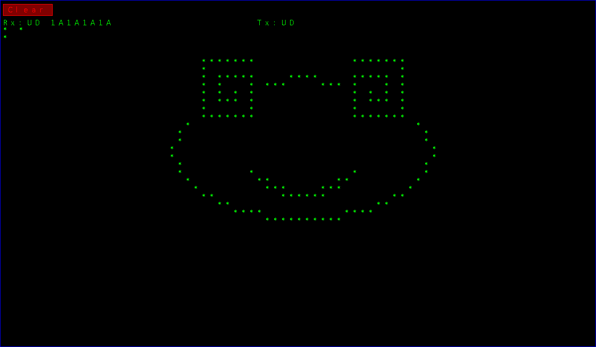

这是一个可以在黑金AX516开发板上运行的千兆以太网MAC和一个简单的FPGA GUI. 是用Python中的MyHDL扩展包写的, 写这些代码的主要目的也就是为了尝试一下用Python MyHDL来写Verilog好不好用. 总的来说还是比较好用的, 可以比裸写Verilog省点事. MyHDL不是高层次综合, 它实际上是用Python的一些功能实现了一个Verilog仿真器,能对用Python写的仿Verilog语言进行仿真,并把Python代码翻译成Verilog. 省事的地方在于Python的简洁,以及可以很方便的看波形,还有可以和其它Python代码结合来进行仿真输入和查看仿真结果.比如写图像处理的模块就很容易把图像输入进行仿真然后查看结果.

在Python MyHDL环境下仿真测试好的代码,翻译成Verilog后就可以直接拿去编译使用了,可以不需要再到ISE或Vivado中去仿真.也就是说MyHDL的仿真和翻译结果都是没有问题的.通过做这个项目俺已经能确认这一点. MyHDL的作者Jan Decaluwe是个设计芯片的工程师,用MyHDL设计过芯片,所以在正确性上是没有问题的.

如果你有AX516开发板,直接把'Verilog'目录中的Top.bit文件下载进去,接上显示器,把板子的网口和电脑直接连起来,在cmd中手工绑定板子的IP和MAC,运行C#上位机程序,就能看到这些代码的效果.显示器上会显示如下方图片的GUI界面,上位机的程序可以连续收到FPGA发送的原始RGB图像数据,并显示成视频.

* 使用Python MyHDL有以下几点需要注意,:

实际上只有@always_seq, @always_comb这两个语句块可用, 虽然MyHDL也支持assign, 但在翻译成Verilog时似乎会出问题, 所以就不要写assign了,全部用@always_comb. 

在用@always_comb时, 如果你在一个@always_comb块中既赋值了一个信号,又引用了这个信号,MyHDL会报错. 这个问题不大, 可以再写一个@always_comb块,把赋值和引用语句分到不同@always_comb块里就行了.

对a = {b,c,d}这样的信号拼接支持的不好,虽然有个连接信号函数支持这个,但只支持仿真,翻译Verilog会出错.所以这样的信号拼接似乎也只能拆开来一个一个的写在@always_comb块里. 这也是用MyHDL要比Verilog麻烦的地方. 

* 下面是测试FPGA和PC机之间千兆以太网通信的一些测试记录:

用FPGA发各种长度的UDP数据包测试了一下上位机各种程序的收包能力,被测试的上位机软件有:WireShark抓包软件, Python和C#写的UDP Socket收包程序, 都是用while(True)循环收包.

发包是连续发的,也就是包和包之间的间隔只有24个字节(协议规定是12个字节),也就是只间隔了24个125M,8ns的时钟周期.

最小数据包的时间长度大概是0.672微秒, 1500字节: 12.16微秒, 1000数据字节: 8.352微秒. 500数据字节: 4.336微秒

WireShark在底层是调用Wincap这个软件抓包的, Wincap是在链路层的抓包软件,能抓到原始的数据包,比应用层要低一层.

测试结果大致为: 数据包长度为1500字节时,WireShark能做到完全不丢包, Python程序能收到98%, 加大帧间隔后Python程序能收到最高约99.95%,但就是达不到100%
C#程序的收包能力最强, 最少在数据包长度为490字节时能做到不丢包.下面是一些具体测试结果, 测试条件是FPGA连续发5万个数据包看上位机程序的接收情况.

数据包长度 ---------- C# ------------- Wireshark

     490            100%          
     480            99.6%  
     460            95.8%     
     400            98.46%      平均60%多,最高能有90%多     
     300            83.2%     
     200            60.1%     
     100            50%            64%     
     最小           28.6%        最高46%,最低12%,平均40%
     

实测显示,C#的收包能力很稳定,在达不到100%时每次测试结果波动不大,WireShark在包最小时看似能比C#强, 但结果波动比较大.
由此可见还是微软自家的C#收包能力比较强.

还测了一下C#用for循环连续发数据包时的发包间隔, 通过WireShark抓包来看的,结果为:

  数据包长度      间隔时间
  
  最小64字节      6 - 8微秒
  
  1500字节        26 - 30 微秒

继续测试发现, 上述Python程序会丢包是因为没有修改默认的接收缓冲区大小设置, 默认Socket接收buffer大小只有8192字节,改到最大大概2G字节后,收包性能和上面的C#测试结果差不多.

以太网数据包最后的CRC校验和IP包包头校验必须算对,不然上位机应用程序收不到包,UDP包中的校验可以没有,设为0即可.1024x512的RGB原始图像传输速率最快可达64帧, 相当于1024x512x3x64= 100.6M字节/秒. 基本达到千兆网实际传输速度上限,连续接收过程中基本没有出现丢包现象.

