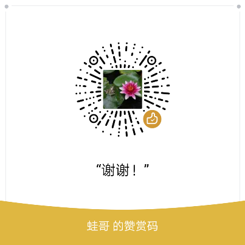

# Kryon
FPGA Image Process, Connected Component Analysis-Labeling

This repository contains some verilog codes for Image Process, like image filtering, image smoothing, edge detecting, binary image erosion, dilation and Connected Component Analysis-Labeling. The codes are detail commented, read the comments and you will know how to use it.

The Connected Component Analysis-Labeling algorithm here is a FPGA based parallel, pipelined, real time Algorithm. It only need to buffer one line of image data, no DDR needed.

I have writen two articles about these codes, it's in 中文，but google translate is goood enough.

* [FPGA Image Processing basic skills FPGA图像处理基本技巧](http://blog.sina.com.cn/s/blog_539ee1ae0102xtnz.html)
 
* [Connected Component Analysis-Labeling algorithm upgrade FPGA实现的连通域识别算法升级](http://blog.sina.com.cn/s/blog_539ee1ae0102xtod.html)

"*CCAL.py*" is the source code of the Connected Component Labeling algorithm animation that I made: 

* https://youtu.be/UVAxT60HppI
* [连通域识别算法动画演示](https://www.bilibili.com/video/av26067000)

"*FPGA Ethernet Mac.py*" is a FPGA MAC and a simple GUI written in python use [MyHDL](http://docs.myhdl.org/en/stable/). It can run on ALINX黑金 AX516 Dev Board. PC can receive Raw Video transmited from FPGA through GBE.

My Photo Album: www.eyeem.com/becomequantum

Email: 3077686006@qq.com
# Donation
My PayPal: ccpp123@sina.com

Wechat:

